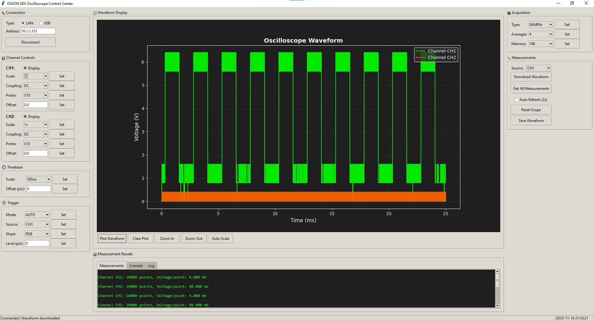

# OWON HDS / SDS Oscilloscope Control

This project provides a Python-based GUI for OWON HDS200/HDS300 and SDS series oscilloscopes, with SCPI control over LAN or USB. It includes a modern front panel for instrument control, waveform acquisition, measurement, and export.

> **Verified hardware:** HDS271, firmware V1.3.0, USB HID. HDS300-series and other HDS200 models share the same command structure and will work, but have not been tested; the app logs an "unverified model" notice on connect so you know.



Verified against an **HDS271, firmware V1.3.0**, over USB HID. The LAN path and the
SDS dialect come from an **SDS6202** and are not re-verified here.

## Features

**Acquisition and control**
- Connect to OWON HDS200/HDS300 or SDS oscilloscopes via LAN or USB
- SCPI command support for instrument configuration
- Download and parse waveform data (screen and deep memory)
- USB auto-detect for OWON serial devices (VID/PID 5345:1234), with a picker when
  more than one is attached
- Query and display measurements (frequency, voltage, timing, etc.)
- Auto-refresh and continuous monitoring, at an interval you choose
- **A transport control and one state read-out**: LIVE with its redraw rate, SINGLE
  while a capture is in flight, OFFLINE when nothing is attached, and FILE when a
  saved capture is open
- Channel controls: display, scale, coupling, probe, vertical offset
- Timebase, trigger, acquisition, and memory depth controls
- A **SCPI console**, read-only until you allow writes, for talking to the
  instrument in its own language
- A **trigger and acquisition read-back panel**: what the instrument says it is
  doing, next to what the capture was actually drawn from
- A **multimeter mode picker**, limited to the functions the instrument answers
- **Software autoset**: frames the time axis from the measured frequency, using the
  one framing write this interface can actually make
- Every instrument call runs on **one owner worker thread** (`scope_io.py`). The
  window never blocks on a query, one call is in flight at a time, a capture jumps
  ahead of a refresh, and repeated requests for the same thing coalesce

**Reading the capture**
- Four views of the same samples: **time, FFT, maths, XY**
- **FFT** with the vendor software's windows (Rectangle, Hanning, Hamming,
  Blackman), in dBV, Vrms or volts, linear or log frequency, with the peaks
  labelled. The frequency axis is derived from the capture's own sample interval,
  never from the instrument's announced rate, and the Nyquist limit is printed on
  the plot
- **Maths traces**: CH1±CH2, CH1×CH2, either channel inverted
- **Measurement cursors**: two time markers giving ΔT, 1/ΔT and each trace's level
  at both, and two voltage markers giving ΔV. Drag them, or click to place them
- A per-channel **0 V marker**, labelled with its offset in volts and in divisions,
  drawn in the channel's colour. It lands in exported figures too
- A **data table** view of the samples

**Keeping it**
- Save as CSV, JSON, Excel (`.xlsx`), PNG or PDF — every format carrying the
  settings that make its numbers checkable
- Open a saved capture and read it offline, in any of the views
- **Unattended recording**: one CSV per frame into a folder you choose, with a
  player to step back through what was recorded
- A **SETUP** screen that saves which scope to talk to, the calibration, the
  monitoring interval, the plot palette and the FFT defaults
- Plot palettes: Dark, Light, and a Print palette for exported figures

## Requirements
- Python 3.7+
- tkinter
- numpy
- matplotlib
- pyserial
- pyusb (for the USB HID transport used by the HDS200/HDS300)
- Pillow

## Usage

From this directory. Windows `cmd`:

```bat
cd /d C:\Users\<you>\Documents\GitHub\PC_SCPI_serial
set TCL_LIBRARY=
set TK_LIBRARY=
.venv\Scripts\python.exe main.py
```

Git Bash:

```bash
unset TCL_LIBRARY TK_LIBRARY
./.venv/Scripts/python.exe main.py
```

Double-clicking `run.bat` does the same thing without a shell: it clears the two
variables below, uses the virtual environment, and passes any arguments through to
`main.py`. `run-portable.cmd` is the self-contained variant - it redirects
`TEMP`/`APPDATA`/`MPLCONFIGDIR` into a `.portable` directory beside the app and writes
its output to `.portable/logs/application.log` instead of using your profile and the
console.

**`set TCL_LIBRARY=` must be its own line in cmd.** Chaining it as
`set TCL_LIBRARY= && ...` leaves the variable set to a single SPACE, which fails
exactly as the original value does; if you want one line, quote it:
`set "TCL_LIBRARY=" && set "TK_LIBRARY=" && .venv\Scripts\python.exe main.py`.

The two variables are cleared because an installed CSR BlueSuite exports
`TCL_LIBRARY` machine-wide, and Tk then refuses to start with "This probably means
that Tcl wasn't installed properly". Removing them is required - setting them
EMPTY is not the same thing and still fails. `run-portable.cmd` clears them for
you, so a double-click works without a shell.

If the project virtual environment does not exist yet:

```bash
python -m venv .venv
./.venv/Scripts/python.exe -m pip install -r requirements.txt
```

## Tests

383 tests, with no instrument attached (the suite mocks the transport). Clear the same
two variables, or tkinter will not start and the GUI tests fail while the rest pass:

```bash
unset TCL_LIBRARY TK_LIBRARY
./.venv/Scripts/python.exe -m unittest discover -s tests -t .
```

Then connect to your oscilloscope and use the GUI to control, acquire, and save
data. Only one process can hold the USB HID endpoint at a time, so closing the
window before running a probe or a second copy is what makes the instrument
answer; start a probe against a scope the app still has open and every reply comes
back empty.

## File Structure

The code is split by domain. `doc/ARCHITECTURE.md` explains the rule between the
layers and what is still to be split; briefly:

```
main.py                    entry point: starts the window
modern_lab.py              the front panel: layout, widgets, dialogs
owon_controller.py         SCPI controller (transport, dialect, framing, measurements)
modernlab/                 everything that is not the UI
  instrument/transport/    bytes over a link: usb_hid.py
  instrument/capture/      payload to volts: waveform.py, decode and calibration
  analysis/                spectrum, maths, cursors, time axis
  storage/                 CSV, JSON, XLSX, PNG, PDF, and reading captures back
  settings/                the bench: which scope, the calibration for it
  app/                     io_worker.py, the single owner of the instrument
tools/                     live diagnostics and the manual calibration helper
archive/                   superseded scripts, kept for reference
```

Nothing under `modernlab/` imports the UI or `tkinter`, which is what lets the suite
run headless.
- `run.bat` - Launcher for a plain `cmd` prompt
- `run-portable.cmd` / `portable_launcher.py` - Self-contained launcher
- `tests/` - The test suite (`python -m unittest discover -s tests -t .`)

## Notes
- I have tested it on a SDS6202 oscilloscope through LAN. To be able to ping it I had to
  change the default MAC address. The USB path is verified on an HDS271; other models in
  both families have not been tried.
- **The SCPI implementation in Owon is buggy**, with little or outdated documentation. The connection often times out and then I have to reconnect.
- **LAN / SDS path**: the SDS6202 test predates the package refactor (see `doc/ARCHITECTURE.md`).
  It has not been re-verified since; treat it as best-effort. The connect dialog shows a
  "legacy, not re-verified" notice when LAN is selected.
- LLM have been used to help build this app. Mostly Deepseek and Copilot.


## HDS200 / HDS300 USB interface

Verified against an HDS271 running firmware V1.3.0. The instrument is a composite device,
VID 0x5345 / PID 0x1234:

| interface | class | endpoints | role |
|---|---|---|---|
| 0 | HID (0x03) | 0x81 IN interrupt, 0x01 OUT interrupt, 64-byte reports | ASCII SCPI |
| 1 | mass storage (0x08/0x06/0x50) | 0x82 IN bulk, 0x02 OUT bulk | 8 MB volume, no filesystem |

`hds_usb.HdsHidTransport` drives interface 0 through pyusb and the installed libusb0.sys
driver. This instrument has no COM port, and no driver change is needed.

Learned on hardware, all of it expensive:

* A write needs a multi-second timeout (500 ms times out); reads must stay short so that
  silence is distinguishable from slowness.
* A read whose size the firmware rejects stalls the endpoint (Errno 32). A halted pipe keeps
  timing out until CLEAR_FEATURE(HALT) is issued, and the halt survives even a fresh process.
  `HdsHidTransport.recover()` therefore runs on open and after two consecutive read failures;
  without it a single wrong-sized read requires unplugging the instrument.
* Channels use the short node: `:CH1:SCALe?`, not `:CHANnel1:SCALe?`.
* Measurements answer per item (`:MEASUrement:CH1:FREQuency?`); `:MEASUrement:CH1?` is silent.
* Replies are engineering notation (5e-04, 5e+00) with loose enum case (AUTo) and are
  normalised onto the UI choice lists by `owon_controller`.
* `:ACQuire:DEPMem` accepts 4K or 8K.
* The instrument's own Utility -> F4 -> USB menu setting does not change the USB descriptors;
  it reports `Oscilloscope MSC+HID` regardless of the selected mode.
* **The front panel's AUTO key is not reachable over USB.** Nine candidate commands were
  sent to an HDS271 (V1.3.0) and read back through the one framing value that is live on
  this firmware - the timebase - plus the volts/div label, trigger level, trigger sweep and
  acquire mode: `:AUTOSet`, `:AUTO`, `:AUTOSet EXECute`, `:SYSTem:AUTOSet`, `:KEY:AUTO`,
  `:TRIGger:AUTO`, `:AUTOSet ON`, `:RUN`, `:STOP`. Not one of them changed any of the five.
  The app's AUTO button therefore frames the time axis itself from the measured frequency
  (see `software_autoset`), then reads every setting the panel mirrors - trigger level,
  sweep, coupling, source and slope, acquisition mode and depth, and each shown channel's
  coupling, display and scale - back into its control. The readback is written with live
  application switched off: these controls apply what they hold, so a value the instrument
  has just given back must not be on its way to the instrument as a write. Pressing the
  physical AUTO key still reaches the app: the framing watch notices the change within
  about a second.
* `:TRIGger:SINGle:EDGE:LEVel?` is momentarily unreliable right after a level write: an
  HDS271 answered `4293V` there while the instrument was settling from its own AUTO, then
  `-2.00V` steadily a moment later. That is the reason the readback exists rather than the
  app trusting an echo of what it asked for - and the reason a level written into the live
  trigger box must be guarded, or that `4293` becomes the next write.

### Downloading the screen capture

`:DATa:WAVe:SCReen:HEAD?` returns a JSON header and `:DATa:WAVe:SCReen:CH1?` a 300-point
payload, paced in exactly-64-byte reports at about a 32 ms interval. The firmware abandons a
payload that is not polled within roughly 100 ms, which is why a missed header is retried
rather than treated as a failure. The legacy START/STARTBIN/STARTBMP upload protocol is
silent and the mass-storage volume carries no filesystem, but the screen capture path works
on this firmware, and it is what the application draws from.

Four properties of these samples cost real time to learn, and each one produces a plausible
but wrong picture if assumed away:

* **Each sample is one byte, and it WRAPS.** The acquisition's offset can sit a signal across
  the 0/255 boundary, so the stream is only continuous modulo 256: a 2.5 Vpp sine arrived as
  `..., 12, 4, 252, 245, ...`, a step of -8 codes rather than -248. Read as absolute values
  that is a signal jumping full scale twice per period - drawn as a vertical stroke through
  the middle of every cycle - and it inflates the span fed to the calibration, which is how a
  2.600 V input came to be drawn and measured as 3.524 V. The codes are walked into a
  continuous series before anything else reads them. A step of half the range or more is left
  as it comes: the branch cannot be resolved at this width, and guessing one would invent a
  waveform.
* **The vertical scale comes from the instrument's own readings, never from the volts/div
  label.** The label is a display string that this firmware does not keep in step with the
  gain. Each capture is calibrated by pinning the decoded extremes onto the instrument's
  MIN/MAX/PKPK - a 2.5 Vpp sine decodes to 2.600 V, which is what the instrument itself
  reports - and the slope is remembered so later captures need no extra round trips.
* **Volts/div and vertical position cannot be written over USB.** Both are accepted and
  ignored, and both corrupt the instrument's own readout. The panel therefore never writes
  them, and its volts/div control moves only what it draws. The timebase write *is* live.
* **The frame is part of the measurement.** It is centred on the capture's own extent rather
  than on 0 V, because the decode puts the code midpoint at the middle of the screen, which is
  only 0 V for a signal that straddles zero: a unipolar 0-25 V sawtooth in a 0 V-centred frame
  has its peaks chopped at the top edge, and the flyback then re-enters from that edge as a
  stroke standing over the ramp. Auto likewise takes the finest display setting at least as
  coarse as the decode (3.19 V/div must land on 5, not 2), and a trace that still does not fit
  is reported together with the setting that would frame it.

`HDS_MANUAL_CALIBRATION_TRIM` in `waveform_data.py` is a bench trim for the case where the
generator is the reference and the instrument is the thing that is off. It is not a fudge
factor for the decode: the calibration above recomputes the slope from the instrument's
readings, so a trim applied downstream of it would cancel itself out.
